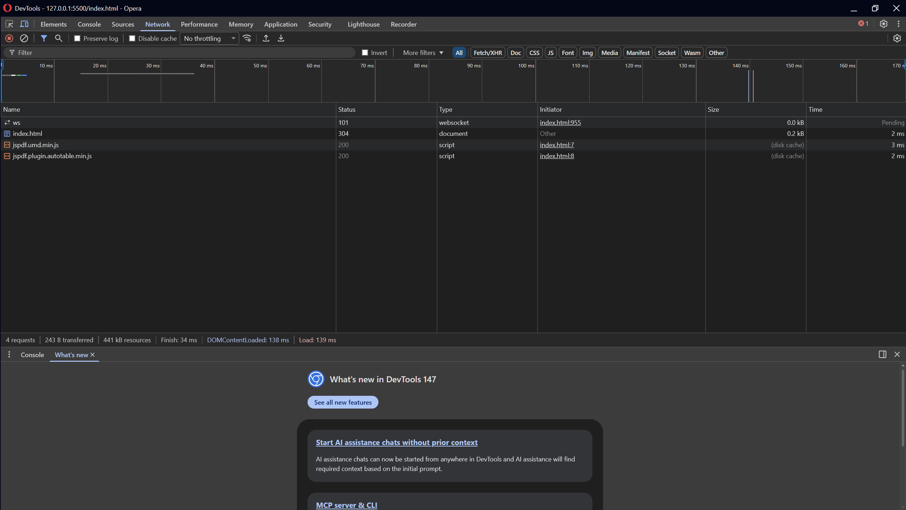

# Bitwarden Backup Code Converter

Convert your Bitwarden JSON exports into clean PDF tables and Canva-ready CSV files with numbered backup codes (1-10).

## Repository Status

- **Security:** Client-Side Only
- **Data:** No Upload
- **Privacy:** No Tracking
- **Open Source:** Yes

---

## Features

- **PDF Export** - Clean table format with auto-sizing columns, perfect for printing
- **CSV Export** - Canva-ready format with multi-line backup codes in each cell
- **Backup Code Detection** - Detects all formats: spaced numbers (3126 6674), hyphenated (AAAA-1111), plain numbers, alphanumeric
- **Folder Mapping** - Correctly maps folderId to folder name from the JSON's folders array
- **Sorted Output** - Entries sorted alphabetically by folder name
- **Clean Text** - Automatically removes emojis and strange characters
- **Print-Ready PDF** - Compact layout with page numbers and total code count
- **Auto-Sizing Columns** - Tables adjust to fit long text like email addresses

---

## Security and Privacy

### Network Tab Verification

Here is the Network tab showing NO external requests (only the CDN libraries for PDF generation):



### This tool runs entirely in your browser. Here is why it is safe:

#### No Data Uploads

Everything runs locally. Your JSON file NEVER leaves your computer. There is no server, no upload, and no data transmission.

#### No Server Communication

No network requests are made. You can verify this by opening your browser's Developer Tools (F12) and going to the Network tab. You will see zero external requests.

#### Open Source

The complete source code is available for you to inspect:
https://github.com/ac7777/bitwarden-backup-code-converter/blob/main/index.html

The code is not minified or obfuscated. Everything is readable.

#### No Data Storage

The tool does not:
- Save your passwords to disk
- Send them anywhere
- Store them in cookies or localStorage
- Share them with third parties

#### Self-Contained

Only one HTML file. No dependencies except for jsPDF and jspdf-autotable, which are loaded from CDN.

---

### How to Verify

1. Open Developer Tools (F12 on Windows/Linux, Cmd+Option+I on Mac)
2. Click the Network tab
3. Use the tool - you will see no network requests
4. Click the Sources tab - you can see all the JavaScript code

### How to Run Safely

1. Download the HTML file from the repository
2. Disconnect from the internet
3. Open the file in your browser
4. The tool works completely offline (after initial CDN load)
5. For maximum security, download jsPDF and jspdf-autotable locally

### Security Checklist

- [x] Open source
- [x] No external API calls
- [x] No data persistence
- [x] No analytics or tracking
- [x] Runs entirely in your browser
- [x] Can be run offline

### Questions or Concerns

If you have security concerns, please leave a comment.

---

## How to Use

### 1. Export from Bitwarden

1. Open Bitwarden
2. Go to Settings -> Export Vault
3. Choose JSON format
4. Save the file

### 2. Use the Converter

1. Open the HTML file in your browser
2. Drag and drop or click to upload your JSON file
3. Click "Convert JSON"
4. Preview your data
5. Download as PDF (print-ready table) or CSV (for Canva/Sheets)

### 3. Import to Canva (for CSV)

1. Download the CSV file
2. Open Canva -> Add a Table element
3. Click "Import data" (top right of the table)
4. Upload your CSV file
5. Enable "Wrap Text" to see each backup code on its own line

---

## Formats

### CSV Format

| Column | Description |
|--------|-------------|
| Folder | The folder name from Bitwarden |
| Username | The login username |
| Password | The account password |
| Backup Codes | All codes numbered 1-10, each on a new line |

### PDF Format

- Clean table with 4 columns
- Auto-sizing columns for long text (email addresses, etc.)
- Each account on its own row
- Backup codes listed vertically
- Page numbers and total code count

---

## Technical Details

- **Pure HTML/CSS/JavaScript** - No server required, runs entirely in your browser
- **No data uploads** - Your data stays local, never leaves your computer
- **jsPDF** - Used for PDF generation
- **jspdf-autotable** - For clean table formatting

---

## Example Input

```json
{
  "folders": [
    { "id": "folder1", "name": "Gaming" },
    { "id": "folder2", "name": "Social" }
  ],
  "items": [
    {
      "type": 1,
      "folderId": "folder1",
      "login": { "username": "ali7", "password": "12345" },
      "notes": "1. 3126 6674\n2. 8151 5915"
    }
  ]
}
```
## Links

- [View the source code](https://github.com/ac7777/bitwarden-backup-code-converter)
- [Report an issue](https://github.com/ac7777/bitwarden-backup-code-converter/issues)
- [Star this project](https://github.com/ac7777/bitwarden-backup-code-converter/stargazers)
- [Fork this project](https://github.com/ac7777/bitwarden-backup-code-converter/fork)

---

## Contributing

Feel free to open issues or submit pull requests.

---

## License

MIT License - see [LICENSE](LICENSE) file for details

---

## Acknowledgments

- Built with love by [ac7777](https://github.com/ac7777)
- Uses [jsPDF](https://github.com/parallax/jsPDF) for PDF generation
- Uses [jspdf-autotable](https://github.com/simonbengtsson/jsPDF-AutoTable) for table formatting

---

**TL;DR:** This is a client-side tool that runs entirely in your browser. Your passwords never leave your computer. You can verify this by checking the Network tab in DevTools.

---

## Questions?

If you have security concerns, please leave a comment.

---

*If this tool helped you, please consider giving it a star.*
